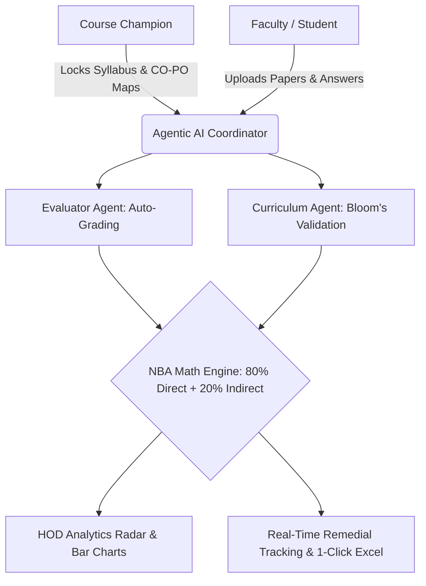

# AAVISHKAR FINAL POSTER TEMPLATE: AI OBE SYSTEM

*After researching past Aavishkar winning posters and conducting a deep sweep of the entire AI OBE System, I have structured this exactly as a 1m x 1m winning poster. Past winners succeed by strictly matching the 100-mark evaluation criteria using highly visual, zero-paragraph, bullet-point structures.*

---

## 🟩 HEADER (Top Bar)
**Aavishkar | Maharashtra State Inter-University Research Convention**
**Category:** Engineering & Technology      **Level:** UG / PG      **Code No.:** XXXX 
*(CRITICAL: Do not write your name, college, or guide's name anywhere!)*

---

## 🟦 TITLE & TAGLINE (Center Top)
**MULTI-AGENT AI SYSTEM FOR OUTCOME-BASED EDUCATION (OBE) AUTOMATION**
*An Agentic framework automating NBA accreditation, subjective auto-grading, and curriculum governance.*

---

## 🟨 COLUMN 1: THE HOOK (Left Side - 25% Width)

### 1. THE PROBLEM *(Relevance: 20 Marks)*
*Colleges face 3 severe bottlenecks in NBA Accreditation:*
- ⏱️ **Time Loss:** 1000s of man-hours wasted on manual mathematical calculations.
- ⚖️ **Subjective Bias:** Manual grading of assignments is biased and slow.
- 🧩 **Curriculum Mismatch:** Decentralized teaching causes mapping errors.

**IMPACT:** **80% Faculty Time Wasted** on clerical tasks instead of pedagogy.

### 2. THE GAP 
| Method | Limitations |
| :--- | :--- |
| **Excel Sheets** | Highly error-prone; isolated data silos. |
| **Traditional ERPs** | Expensive (₹5L+); rigid; no intelligent insights. |
| **Our Solution** | **Agentic AI Grading + Automated Math + Real-Time Tracking.** |

### 3. OBJECTIVES
- **Automate** complex 80/20 NBA mathematical engines.
- **Deploy** Agentic AI for objective, rubric-based auto-grading.
- **Standardize** curriculum via a "Course Champion" governance model.

---

## 🟪 COLUMN 2: THE CORE (Center - 50% Width)

### 4. SYSTEM ARCHITECTURE *(Methodology: 20 Marks)*
*(Make this Mermaid diagram the largest visual element on the poster)*

### 5. EXHAUSTIVE FEATURES (What We Built)
*(Place these 3 visual boxes below the diagram)*

📦 **1. Governance & Setup**
- **Course Champion:** Centralized locking of syllabus and mappings.
- **Dynamic Mappings:** CO-PO and CO-PSO threshold matrices.
- **Student Portals:** Integrated Course Exit Surveys.

🤖 **2. Agentic AI Integration**
- **Evaluator Agent:** Auto-grades subjective answers against rubrics in seconds.
- **Curriculum Agent:** Validates Bloom's Taxonomy of question papers.
- **Insights Agent:** Generates department strengths/weaknesses for HODs.

🧮 **3. NBA Math Engine & Analytics**
- **Threshold Logic:** e.g., 60% students > 60% marks = Level 1.
- **Automated Attainment:** 80% Direct (Assessments) + 20% Indirect (Surveys).
- **HOD Dashboards:** Radar Charts & Real-time Remedial Action tracking.
- **1-Click Export:** Instantly generates NBA Table 3.1.2.

---

## 🟧 COLUMN 3: THE PROOF (Right Side - 25% Width)

### 6. OUR INNOVATION *(Innovation: 20 Marks)*
- 🧠 **Agentic Auto-Grading:** Replaces manual checking with objective, LLM-driven scoring.
- 🚦 **Proactive Remedial Tracking:** Flags at-risk students *during* the semester, not after.
- 👑 **Champion Standardization:** Eradicates CO-PO mismatches across multi-division courses.

### 7. RESULTS *(Outcome: 20 Marks)*
*(Use Big Icons and Numbers. Add a Bar Chart comparing processing time)*
- ⏱️ **< 3 SECONDS:** To auto-grade subjective assessment batches.
- 🎯 **100% UNIFORMITY:** Syllabus & Mapping standardized instantly.
- 📊 **ZERO ERRORS:** In complex NBA Table 3.1.2 mathematical generation.

### 8. OUR CONTRIBUTION *(Contribution: 20 Marks)*
- 💻 **Backend:** Engineered FastAPI Multi-Agent Coordinator.
- 🔢 **Algorithms:** Developed `attainment.js` for local threshold mathematics.
- 🖥️ **UI/UX:** Built Role-Specific Dashboards (Admin, HOD, Faculty, Student) using Chart.js.

### 9. COST & FUTURE SCOPE
- 💰 **Cost:** ₹0 Prototype (Open-Source) vs ₹5 Lakh+ Commercial ERPs.
- 🚀 **Future Work:** Deploy local, offline LLMs (Llama 3); Expand to Pharmacy/Medical Councils.
