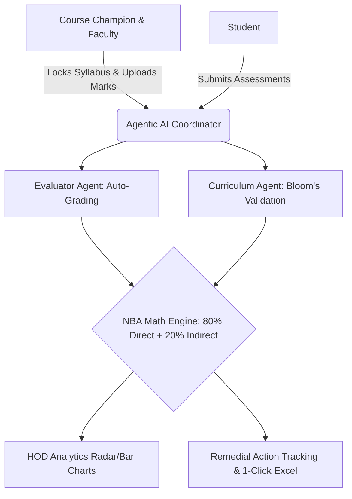

# AI OBE System — Ultra-Condensed Poster Layout (Zero Paragraphs)

*For a 1m x 1m poster, nobody reads paragraphs. Everything below is formatted exactly as it should appear on the flex board: short, punchy, and highly scannable.*

---

### HEADER
**Category:** Engineering & Technology      **Level:** UG      **Code No.:** XXXX 

---

### 1. TITLE
**MULTI-AGENT AI SYSTEM FOR OUTCOME-BASED EDUCATION (OBE) & AUTO-GRADING**
*Tagline: Automating NBA accreditation, subjective grading, and curriculum governance.*

---

### 2. THE PROBLEM
*Engineering institutes face 3 major bottlenecks during NBA Accreditation:*
- ❌ **Time Loss:** 1000s of man-hours wasted on manual CO-PO mathematical calculations.
- ❌ **Subjective Bias:** Manual grading of assessments is biased and extremely slow.
- ❌ **Curriculum Mismatch:** Decentralized teaching causes mapping errors across divisions.

---

### 3. THE GAP
| Method | Limitations |
| :--- | :--- |
| **Excel Sheets** | Highly error-prone; isolated data silos. |
| **Traditional ERPs** | Expensive (₹5 Lakh+); rigid; no intelligent insights. |
| **Our Solution** | **Automated Math + Agentic AI Grading + Real-Time Remedial Tracking.** |

---

### 4. SYSTEM ARCHITECTURE
*(Draw a massive diagram connecting these 4 modules)*

---

### 5. OBJECTIVES
- **Automate** complex 80/20 NBA mathematical engines.
- **Deploy** Multi-Agent AI for rubric-based subjective auto-grading.
- **Standardize** curriculum via a "Course Champion" governance model.

---

### 6. EXHAUSTIVE FEATURES (What We Built)
*(Present as 3 Visual Boxes)*

📦 **1. Governance & Setup**
- Course Champion Model (Locks syllabus/mapping for all divisions)
- Dynamic CO-PO/PSO Matrix
- Automated Curriculum Gap Identification

🤖 **2. Agentic AI Integration**
- **Evaluator Agent:** Auto-grades subjective answers against rubrics in seconds.
- **Curriculum Agent:** Validates Bloom's Taxonomy of question papers.
- **Insights Agent:** Analyzes department strengths/weaknesses for the HOD.

🧮 **3. NBA Math Engine & Analytics**
- Strict Threshold Logic (e.g., 60% students > 60% marks = Level 1).
- Direct (Assessments) + Indirect (Surveys) Calculation.
- HOD Radar Charts & Real-time Remedial Action tracking.
- 1-Click NBA Table 3.1.2 Excel Export.

---

### 7. OUR INNOVATION (20 Marks)
- 🧠 **Agentic Auto-Grading:** Bypasses manual checking; uses LLMs for objective, rubric-driven scoring.
- 🚦 **Proactive Remedial Tracking:** Flags at-risk students *during* the semester, enforcing immediate action plans.
- 👑 **Course Champion Standardization:** Eradicates mapping mismatches across multi-division courses.

---

### 8. RESULTS (The "Prove It")
*(Use Big Icons and Numbers)*
- ⏱️ **< 3 Seconds:** Auto-grade subjective assessment batches.
- 🎯 **100% Uniformity:** Syllabus & Mapping standardized instantly.
- 📊 **Zero Errors:** In complex NBA Table 3.1.2 mathematical generation.

---

### 9. OUR CONTRIBUTION
- 💻 **Backend:** Engineered FastAPI Multi-Agent Coordinator.
- 🔢 **Algorithms:** Developed `attainment.js` for local threshold mathematics.
- 🖥️ **UI/UX:** Built Role-Specific Dashboards (Admin, HOD, Faculty, Student) using Chart.js.

---

### 10. COST & IMPACT
- 💰 **Cost:** ₹0 Prototype (Open-Source) vs ₹5 Lakh+ Commercial ERPs.
- 🏫 **Academic:** Guarantees NBA compliance; saves faculty 80% clerical workload.

---

### 11. LIMITATIONS & FUTURE WORK
- ⚠️ **Limitation:** Currently relies on external LLM APIs (Requires Internet).
- 🚀 **Future Work:** Deploy local, offline LLMs (Llama 3); Expand to Pharmacy/Medical Councils.

---

## 3-Minute Presentation Script (No Paragraphs, Just Cues)
**[0:00 - The Problem]** 
* "Good morning, I am Code XXXX."
* "Problem: Colleges waste 1000s of hours on manual NBA math. Grading is biased. Syllabus gets fragmented."

**[1:00 - The Solution & Innovation]**
* "Solution: I built a Multi-Agent AI OBE System."
* "Innovation 1: 'Course Champion' locks curriculum for 100% standardization."
* "Innovation 2: 'Agentic AI'. Faculty upload papers, AI checks Bloom's levels. Students submit answers, AI auto-grades via rubrics instantly."

**[2:00 - The Results & Impact]**
* "The core Math Engine processes 80% direct and 20% indirect marks without errors."
* "Instead of waiting for end-of-year reports, the HOD gets real-time Radar charts and tracks Remedial Action plans immediately."
* "Results: Cuts processing to under 3 seconds, eliminates grading bias, costs nothing compared to 5-Lakh ERPs. It's ready for deployment."
