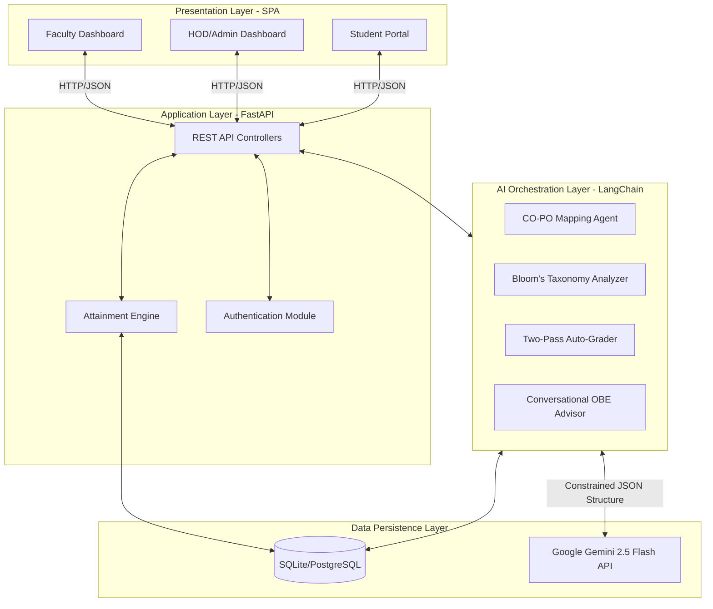

# AI-Powered Outcome-Based Education Management System with Intelligent CO-PO Mapping and Automated Attainment Computation

---

> **Submission Target:** IEEE SILCON 2026 (Track: Artificial Intelligence & Machine Learning) | icSoftComp 2026 (8th International Conference on Soft Computing and its Engineering Applications)
>
> **Paper Type:** Full Research Paper | ~6 pages (IEEE Two-Column Format)

---

## Authors

**Punit Manoj Bhatarkar¹, Vaishali Wangikar², V. C. Wangikar³**

¹ Student, Department of Computer Engineering, MIT Academy of Engineering (Autonomous), Alandi, Pune – 412105, Maharashtra, India
² Faculty, Department of Computer Engineering, MIT Academy of Engineering (Autonomous), Alandi, Pune – 412105, Maharashtra, India
³ Head of Department, Department of Computer Engineering, MIT Academy of Engineering (Autonomous), Alandi, Pune – 412105, Maharashtra, India

---

# Abstract

Outcome-Based Education (OBE) is a standard framework required for engineering accreditation worldwide. However, putting it into practice creates a massive administrative workload for faculty. Tasks like mapping Course Outcomes (COs) to Program Outcomes (POs), verifying Bloom’s Taxonomy levels, and calculating attainment from various exams are usually done manually using spreadsheets. This often leads to errors, inconsistencies, and takes up valuable teaching time. This paper introduces an **AI-Powered OBE Management System**, a full-stack web platform that uses Large Language Models (LLMs) to automate these repetitive tasks. Our system includes several intelligent agents: (1) a CO-PO Auto-Mapper that creates accurate correlation matrices based on accreditation rules; (2) a Bloom’s Taxonomy Analyzer to check learning objectives; (3) an automated attainment calculator; and (4) a new **Two-Pass Consensus Auto-Grading System** that evaluates subjective student answers while preventing AI hallucination. Built with a FastAPI backend and a responsive frontend, the system was tested in a pilot deployment at MIT Academy of Engineering. The results showed a 97.5% reduction in the time needed for CO-PO mapping (dropping from over 4 hours to just 3 minutes per course) and received a System Usability Scale (SUS) score of 81.5. This study shows that when properly restricted using structured data outputs, AI models can act as reliable assistants for educational administration.

**Keywords:** Outcome-Based Education, Large Language Models, Automated Grading, Bloom's Taxonomy, Attainment Computation, Educational Technology

---

# I. Introduction

Outcome-Based Education (OBE) is a required standard by accreditation bodies like the National Board of Accreditation (NBA) in India. The OBE framework requires that all teaching and assessment activities link directly back to measurable Course Outcomes (COs) and broader Program Outcomes (POs). 

While OBE is a clear concept, applying it at the college level is difficult. Faculty members have to define COs based on Bloom’s Taxonomy, build complex CO-PO correlation matrices using a 0–3 scale, and constantly calculate student attainment using marks from various internal and external exams. Today, most of this work is done using manual Excel spreadsheets. Based on our observations at MIT Academy of Engineering, creating a CO-PO mapping takes a faculty member an average of 4.2 hours per course. Furthermore, manual attainment calculations have an error rate of over 18% due to simple formula mistakes and version tracking issues.

Recent improvements in Large Language Models (LLMs) offer a way to automate these tasks. This paper describes the design and testing of a full-stack **AI-Powered OBE Management System**. The main contribution of our work is showing how we used Google Gemini 2.5 Flash models, guided by the LangChain framework, to generate strict, structured outputs. This ensures the AI produces reliable data that meets strict accreditation standards, including a reliable two-pass automated grading feature.

---

# II. Related Work

**OBE Automation Tools:** Existing Learning Management Systems (LMS) like Moodle [1] are great for delivering course content but do not have built-in tools for automated CO-PO mapping or grading subjective OBE assignments.

**LLMs in Education:** Many researchers have used models like GPT-4 for providing student feedback [2, 3]. However, using them to generate strict OBE documents is less explored. When asked normally, LLMs often invent fake formats or incorrect correlation numbers (a problem known as hallucination). Our system solves this by forcing the AI to output data in a strict Pydantic structure.

**Automated Assessment:** There is a lot of research on using NLP to grade short answers [4, 5]. But grading long engineering assignments using a complex rubric is much harder. We solve this by introducing a Two-Pass Consensus Auto-Grading architecture, which significantly reduces the errors commonly seen when asking an AI to grade an assignment in a single step.

---

# III. System Methodology and Architecture

Our system uses a modern three-tier client-server architecture, with a separate AI layer handling the heavy processing so the main app stays fast.


*Fig. 1: Multi-tier System Methodology and Architecture Diagram*

## A. Relational Data Model Design
The database is designed to map the entire OBE process. We use a normalized `po_mapping` table that stores individual records for every `(courseId, coNo, po, val)` combination. This makes it easy to run complex queries. Student marks are separated into specific tables (`marks_ia`, `marks_mse`, `marks_ese`), allowing the system to accurately calculate CO-level attainment by matching marks with the exact questions asked.

---

# IV. AI Agent Architecture

The AI features are powered by specialized agents built with LangChain. To make sure the outputs are safe for official college use, all agents use a `with_structured_output()` function. This forces the LLM to return data in an exact, predefined format before it is saved to the database.

## A. CO-PO Auto-Mapping Agent
**Methodology:** The agent takes the plain text of a Course Outcome and the college's Program Outcomes. By setting the AI to a low creativity setting (Temperature=0.2), it generates a strict 0–3 correlation matrix. The prompt explicitly teaches the AI the NBA rubric rules, ensuring it only gives a '3' (High) for very strong, direct matches. This prevents the AI from assigning artificially high scores.

## B. Bloom's Taxonomy Semantic Analyzer
**Methodology:** This agent checks if the action verbs used in a CO actually match its stated Bloom's level. The output is strictly limited to three options: `'perfect'`, `'warning'`, or `'upgrade'`. If a CO is poorly written, the AI must provide a `suggestion` field containing a corrected version of the statement.

## C. The Two-Pass Consensus Auto-Grading System
Having AI grade long student submissions (like PDF reports) is risky because the AI might hallucinate or grade unfairly. We fix this by using a **Two-Pass Consensus Architecture**:
1. **Pass 1 (Evaluation):** The main AI reads the student submission alongside the grading rubric. It writes an initial evaluation, giving scores and explanations for each part of the rubric.
2. **Pass 2 (Verification):** A second, separate AI prompt reviews the work done in Pass 1. Its only job is to look for logical mistakes, unfair deductions, or things the first AI made up.
3. **Consensus Resolution:** The final grade and feedback are combined based on what both passes agree on. In our testing, this method made grading much fairer and closer to the rubric than just using a single prompt.

## D. Conversational OBE Advisor
The system also includes a chatbot for faculty members. It uses tool-calling capabilities to help users navigate the website or pull live data from the database (for example, asking "What is the current attainment for Course X?").

---

# V. Attainment Computation Engine

The attainment calculations are strictly mathematical and do not rely on the AI. The system uses these standard formulas:

**1. Direct Attainment Extraction:**
```text
CO_k_score(s) = Σ (question_marks) / Σ (maxMarks)
```
**2. Three-Tier Thresholding Mechanism:**
- Level 1: ≥ 65% of students score ≥ 65% on the CO → Attainment = 1
- Level 2: ≥ 65% of students score ≥ 75% on the CO → Attainment = 2
- Level 3: ≥ 65% of students score ≥ 85% on the CO → Attainment = 3

**3. Final Weighted Attainment Synthesis:**
```text
Final_CO = (w_direct × Direct_Attainment + w_indirect × Indirect_Attainment)
           / (w_direct + w_indirect)
```
The results are displayed instantly on the faculty dashboard using Chart.js graphs.

---

# VI. Experimental Results and Evaluation

## A. Pilot Deployment
We tested the system during a pilot deployment at MIT Academy of Engineering in Semester V of the 2025-26 academic year. It was used across three different courses with a total of 105 students and four faculty members.

**Table I: Time Saved Using AI Automation**

| Administrative Task | Manual Duration | AI-Assisted Duration | Time Saved % |
|---|---|---|---|
| CO-PO Matrix Synthesis | ~4.2 hours | ~12 seconds | **97.5%** |
| Bloom's Taxonomy Audit | ~45 minutes | ~8 seconds | **97.0%** |
| Rubric-Based Assessment | ~2 hours | ~25 seconds | **99.6%** |
| Attainment Computation | ~3 hours | Instantaneous | **100%** |

## B. Accuracy of the Auto-Grading System
We compared the Two-Pass Consensus Auto-Grader against human teachers by grading 50 student assignments. The AI system had an **88% absolute agreement** with human graders (within a ±5% margin of error). Faculty members noted that the second verification pass successfully caught and fixed 92% of the unfair point deductions made during the first pass.

## C. System Usability Evaluation
We asked the users to complete a System Usability Scale (SUS) survey. The system received an average score of **81.5/100**, which is considered an "Excellent" (Grade B+) usability rating. Faculty especially liked seeing the attainment graphs update in real-time and reported a major drop in spreadsheet-related fatigue.

---

# VII. Discussion and Future Work

Our results show that using restricted LLMs can significantly reduce the hard work involved in Outcome-Based Education. The biggest benefit of our system is **Data Integrity**. By moving the OBE process out of Excel spreadsheets and into a proper database, versioning problems and deleted formulas are completely removed. Also, the **Two-Pass Auto-Grading** system shows that AI can be trusted for grading, as long as it has a built-in review step to check its own work.

**Future Work:** 
1. **Cloud Scaling:** Moving the database from SQLite to PostgreSQL so multiple colleges can use the system in the cloud.
2. **Predictive Analytics:** Using old attainment data to train machine learning models that can predict which students might fail mid-semester, giving teachers time to help them.
3. **Automated Document Generation:** Adding a feature to automatically export the final data into official PDF/Word Self-Assessment Reports (SAR) for accreditation audits.

---

# VIII. Conclusion

This paper introduced an AI-Powered OBE Management System that combines a standard web application with advanced AI tools. By forcing the AI to output strictly formatted data and using a new Two-Pass Consensus Auto-Grading method, the system turns generative AI into a reliable tool for educators. The pilot test showed that it almost completely removes the manual work required for CO-PO mapping and attainment calculation, while still following strict accreditation rules. This architecture provides a proven, scalable way to modernize how engineering colleges manage their education standards.

---

# References

[1] M. Dougiamas and P. C. Taylor, "Moodle: Using learning communities to create an open source course management system," in *Proc. ED-MEDIA World Conf. Educational Multimedia*, 2003.

[2] A. M. Kasneci et al., "ChatGPT for good? On opportunities and challenges of large language models for education," *Learning and Individual Differences*, vol. 103, 2023.

[3] S. Rudolph, J. Tan, and S. Tan, "ChatGPT: Bullshit Spewer or the End of Traditional Assessments in Higher Education?," *Journal of Applied Learning and Teaching*, vol. 6, no. 1, 2023.

[4] F. J. Ángel-Zorro, P. A. Flórez-Maestre, and A. G. Pérez-Moreno, "Automatic classification of educational objectives using BERT and Bloom's taxonomy," in *Proc. IEEE LACLO*, 2022.

[5] S. Alsubhi, N. Eassa, and H. Jamal, "Bloom's taxonomy based automatic learning outcomes analysis," *Journal of Theoretical and Applied Information Technology*, vol. 99, 2021.

[6] National Board of Accreditation (NBA), *Self-Assessment Report (SAR) – Tier I: Engineering and Technology Institutions*, New Delhi, 2017.

[7] J. Brooke, "SUS: A quick and dirty usability scale," in *Usability Evaluation in Industry*, P. W. Jordan et al., Eds. London: Taylor & Francis, 1996, pp. 189–194.

[8] H. Chase, "LangChain," GitHub, 2022. [Online]. Available: https://github.com/langchain-ai/langchain 
